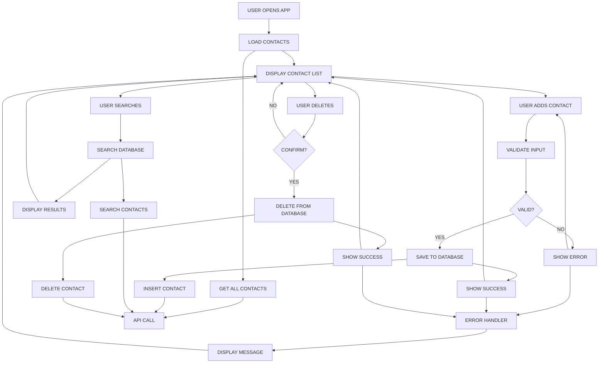

# Contact Manager Application

A modern, full-stack contact management application built with React.js frontend and Node.js backend.

---

##  Application Workflow Diagram

Below is a concise workflow diagram of the Contact Manager application, representing the main user flows and backend interactions:



---

## Database Configuration

The backend uses **MongoDB** for storing contacts.

- **Default URI:** `mongodb://127.0.0.1`
- **Database Name:** `Contacts`
- **Collection Name:** `contacts`
- **Configuration Location:** `backend/database.js`
- **Indexes:**
  - Unique index on `email`
  - Index on `name`
  - Index on `createdAt`

**To change the database URI or name:**
- Edit the `this.uri` and `this.dbName` fields in the `ContactDatabase` class constructor in `backend/database.js`.
- For production, you can use an environment variable (e.g., `MONGODB_URI`) and update the code to use `process.env.MONGODB_URI` if present.

**Example (in `backend/database.js`):**
```js
this.uri = process.env.MONGODB_URI || "mongodb://127.0.0.1";
this.dbName = process.env.DB_NAME || "Contacts";
```

---

## 🏗️ Project Structure

```
Contact-Manager/
├── backend/
│   ├── database.js
│   ├── server.js
│   ├── server.basic.test.js
│   ├── package.json
│   ├── package-lock.json
│   └── node_modules/           # (ignored by git)
├── frontend/
│   ├── package.json
│   ├── package-lock.json
│   ├── node_modules/           # (ignored by git)
│   ├── public/
│   │   └── index.html
│   └── src/
│       ├── App.js
│       ├── App.css
│       ├── App.test.js
│       ├── index.js
│       ├── components/
│       │   ├── ContactForm.js
│       │   ├── ContactList.js
│       │   ├── ContactItem.js
│       │   ├── SearchBox.js
│       │   └── Message.js
│       └── services/
│           ├── api.js
│           └── api.test.js
├── .gitignore
└── README.md
```

---

##  Features

###  Core Functionality
- **Add Contacts**: Add new contacts with name and email validation
- **View Contacts**: Display all contacts in a clean, card-based interface
- **Search Contacts**: Real-time search by name or email
- **Delete Contacts**: Remove contacts with confirmation dialog

### User Experience
- **Modern UI**: Clean, responsive design with hover effects
- **Form Validation**: Real-time validation with helpful error messages
- **Loading States**: Visual feedback during API operations
- **Success/Error Messages**: Clear feedback for all user actions
- **Responsive Design**: Works perfectly on desktop, tablet, and mobile

###  Technical Features
- **Component Architecture**: Modular React components
- **API Service Layer**: Clean separation of API calls
- **Error Handling**: Comprehensive error handling and recovery
- **RESTful API**: Well-designed backend endpoints
- **Input Validation**: Both frontend and backend validation

##  Technology Stack

### Frontend
- **React.js** - Modern UI framework
- **CSS3** - Custom styling with modern features
- **Jest & React Testing Library** - Testing framework

### Backend
- **Node.js** - Server runtime
- **Express.js** - Web framework
- **express-validator** - Input validation
- **CORS** - Cross-origin resource sharing

## Installation & Setup

### Prerequisites
- Node.js (v14 or higher)
- npm or yarn

### Backend Setup
```bash
cd backend
npm install
npm start
```
The backend will run on `http://localhost:3001`

### Frontend Setup
```bash
cd frontend
npm install
npm start
```
The frontend will run on `http://localhost:3000`

## Testing

### Frontend Tests
```bash
cd frontend
npm test
```

### Backend Tests
```bash
cd backend
npm test
```

### Test Coverage
The application includes comprehensive tests covering:
-  Component rendering
-  User interactions
-  Form validation
-  API endpoints
-  Error handling


## 🔌 API Endpoints

| Method | Endpoint | Description |
|--------|----------|-------------|
| GET | `/api/contacts` | Get all contacts |
| POST | `/api/contacts` | Add new contact |
| DELETE | `/api/contacts/:id` | Delete contact |
| GET | `/api/contacts/search?q=term` | Search contacts |
| GET | `/api/health` | Health check |

##  Key Features Implementation

### Search Functionality
- **Real-time search** as you type
- **Search by name AND email**
- **Case-insensitive matching**
- **Empty search shows all contacts**

### Form Validation
- **Required field validation**
- **Email format validation**
- **Duplicate email prevention**
- **Real-time feedback**

### Error Handling
- **Network error recovery**
- **User-friendly error messages**
- **Graceful degradation**
- **Loading states**

##  Deployment

### Frontend Deployment
```bash
cd frontend
npm run build
```
Deploy the `build` folder to your hosting service.

### Backend Deployment
```bash
cd backend
npm start
```


## License

This project is open source and available under the [MIT License](LICENSE).


---

**Built  using React.js and Node.js** 