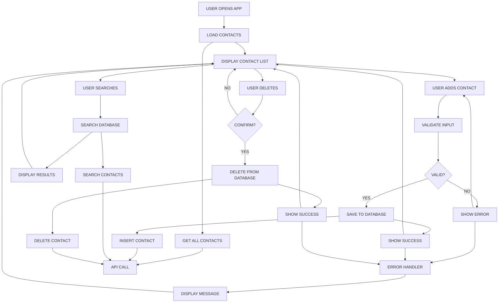

# Contact Manager Application

A modern, full-stack contact management application built with React.js frontend and Node.js backend, now using SQLite for lightweight, serverless database storage.

---

## How to Run This App

1. **Clone the repository:**
   ```bash
   git clone <your-repo-url>
   cd Contact-Manager
   ```
2. **Start the backend:**
   ```bash
   cd backend
   npm install
   npm run init-db    # Initialize SQLite database with sample data
   npm start
   # The backend runs on http://localhost:3001
   ```
3. **Start the frontend:**
   ```bash
   cd ../frontend
   npm install
   npm start
   # The frontend runs on http://localhost:3000
   ```

---

##  Solution Overview & Design Decisions

This project demonstrates a clean, maintainable approach to building a full-stack Contact List Manager. The backend is built with Node.js/Express and SQLite, while the frontend uses React for a responsive, dynamic UI.

**Key design decisions and trade-offs:**
- **Simplicity & Clarity:** The code is organized for readability and maintainability, with clear separation between backend and frontend.
- **Database Choice:** SQLite provides a lightweight, serverless database perfect for small to medium applications without external dependencies.
- **Validation:** Both frontend and backend validate input to prevent empty fields and duplicate emails.
- **Search:** Efficient search is implemented using SQLite indexes and LIKE queries.
- **Error Handling:** All edge cases (empty fields, duplicates, invalid input) are handled gracefully with user-friendly messages.
- **Bonus Features:** Delete functionality, basic styling, and tests are included (see below).
- **Extensibility:** The codebase is structured to allow easy addition of new features (e.g., phone number, pagination, authentication).
- **Time Management:** Focused on core requirements and code quality within the 2-hour window. If more time were available, I would add more advanced features and polish.

---

## Application Workflow Diagram

Below is a concise workflow diagram of the Contact Manager application, representing the main user flows and backend interactions:



---

## Database Configuration

The backend uses **SQLite** for storing contacts, providing a lightweight, serverless database solution.

- **Database File:** `contacts.db` (automatically created in backend directory)
- **Table Name:** `contacts`
- **Configuration Location:** `backend/database.js`
- **Indexes:**
  - Unique index on `email`
  - Index on `name`
  - Index on `created_at` (descending)

**Database Schema:**
```sql
CREATE TABLE contacts (
  id INTEGER PRIMARY KEY AUTOINCREMENT,
  name TEXT NOT NULL CHECK(length(name) > 0 AND length(name) <= 50),
  email TEXT NOT NULL UNIQUE CHECK(email LIKE '%_@__%.__%'),
  created_at DATETIME DEFAULT CURRENT_TIMESTAMP
);
```

**Performance Features:**
- **WAL Mode**: Write-Ahead Logging for better concurrent access
- **Prepared Statements**: Reusable SQL statements for optimal performance
- **Memory Optimization**: Configurable memory settings for better performance

**To initialize the database:**
```bash
cd backend
npm run init-db
```

---

##  Project Structure

```
Contact-Manager/
├── backend/
│   ├── database.js          # SQLite database operations
│   ├── server.js            # Express server and API routes
│   ├── init-db.js           # Database initialization script
│   ├── server.basic.test.js # Backend tests
│   ├── package.json         # Dependencies and scripts
│   ├── package-lock.json
│   ├── .gitignore           # Excludes SQLite database files
│   └── README.md            # Backend-specific documentation
├── frontend/
│   ├── package.json
│   ├── package-lock.json
│   ├── public/
│   │   └── index.html
│   └── src/
│       ├── App.js
│       ├── App.css
│       ├── App.test.js
│       ├── index.js
│       ├── components/
│       │   ├── ContactForm.js
│       │   ├── ContactList.js
│       │   ├── ContactItem.js
│       │   ├── SearchBox.js
│       │   └── Message.js
│       └── services/
│           ├── api.js
│           └── api.test.js
├── .github/
│   └── workflows/
│       └── superlint.yaml   # GitHub Actions CI pipeline
├── .gitignore
└── README.md
```

---

## Features

### Core Functionality
- **Add Contacts**: Add new contacts with name and email validation
- **View Contacts**: Display all contacts in a clean, card-based interface
- **Search Contacts**: Real-time search by name or email
- **Delete Contacts**: Remove contacts with confirmation dialog

### User Experience
- **Modern UI**: Clean, responsive design with hover effects
- **Form Validation**: Real-time validation with helpful error messages and visual indicators
- **Name Validation**: Prevents numbers and symbols in names with immediate feedback
- **Loading States**: Visual feedback during API operations
- **Success/Error Messages**: Clear feedback for all user actions
- **Responsive Design**: Works perfectly on desktop, tablet, and mobile

### Technical Features
- **Component Architecture**: Modular React components
- **API Service Layer**: Clean separation of API calls
- **Error Handling**: Comprehensive error handling and recovery
- **RESTful API**: Well-designed backend endpoints
- **Input Validation**: Both frontend and backend validation with regex patterns
- **Real-time Validation**: Immediate feedback with visual styling
- **SQLite Database**: Lightweight, serverless database with optimized performance

---

## Bonus Features
- **Delete Contact**: Users can delete contacts with confirmation.
- **Basic Styling**: The UI is styled for clarity and usability.
- **Basic Tests**: Key backend and frontend logic is covered by tests.
- **SQLite Integration**: Serverless database perfect for deployment without external dependencies.

---

## Screenshots

<!-- Add screenshots or a screen recording here if desired -->

---

## Testing

### Frontend Tests
```bash
cd frontend
npm test
```

### Backend Tests
```bash
cd backend
npm test
```

### Test Coverage
The application includes comprehensive tests covering:
-  Component rendering
-  User interactions
-  Form validation (including name format validation)
-  Real-time validation feedback
-  API endpoints
-  Error handling

---

## API Endpoints

| Method | Endpoint | Description |
|--------|----------|-------------|
| GET | `/api/contacts` | Get all contacts |
| POST | `/api/contacts` | Add new contact |
| DELETE | `/api/contacts/:id` | Delete contact |
| GET | `/api/contacts/search?q=term` | Search contacts |
| GET | `/api/health` | Health check |

---

## Key Features Implementation

### Search Functionality
- **Real-time search** as you type
- **Search by name AND email**
- **Case-insensitive matching** using SQLite LIKE queries
- **Empty search shows all contacts**

### Form Validation
- **Required field validation** - Both name and email must be provided
- **Email format validation** - Ensures valid email format using regex
- **Name format validation** - Only letters and spaces allowed (regex: `/^[A-Za-z\s]+$/`)
- **Duplicate email prevention** - Prevents adding contacts with existing emails
- **Real-time feedback** - Immediate validation with visual indicators
- **Visual error styling** - Red borders and background for invalid inputs
- **Error message display** - Clear, user-friendly error messages

### Error Handling
- **Network error recovery**
- **User-friendly error messages**
- **Graceful degradation**
- **Loading states**

### Validation Implementation Details
- **Frontend Validation**: Real-time validation using React hooks and useEffect
- **Backend Validation**: Server-side validation using express-validator middleware
- **Regex Pattern**: `/^[A-Za-z\s]+$/` ensures only letters and spaces in names
- **Error Messages**: Consistent error messages across frontend and backend
- **Visual Feedback**: CSS classes for error states with smooth animations
- **Focus Management**: Automatic focus on invalid fields for better UX

---

## Migration from MongoDB

This application has been successfully migrated from MongoDB to SQLite, providing several benefits:

- **No External Dependencies**: Single file database, no server setup required
- **Better Performance**: Optimized with WAL mode, indexes, and prepared statements
- **Easier Deployment**: No need to install/configure MongoDB
- **Same API Interface**: Frontend code works without any changes
- **Lightweight**: Perfect for small to medium applications

---

## Deployment

### Frontend Deployment
```bash
cd frontend
npm run build
```
Deploy the `build` folder to your hosting service.

### Backend Deployment
```bash
cd backend
npm run init-db    # Initialize database on first deployment
npm start
```
Deploy to your Node.js hosting service (Heroku, Vercel, etc.). The SQLite database will be created automatically.

**Note**: For production deployments on EC2 or other cloud platforms, ensure you have proper environment variables configured and database persistence set up.

---

## License

This project is open source and available under the [MIT License](LICENSE).

---

**Built using React.js, Node.js, and SQLite** 